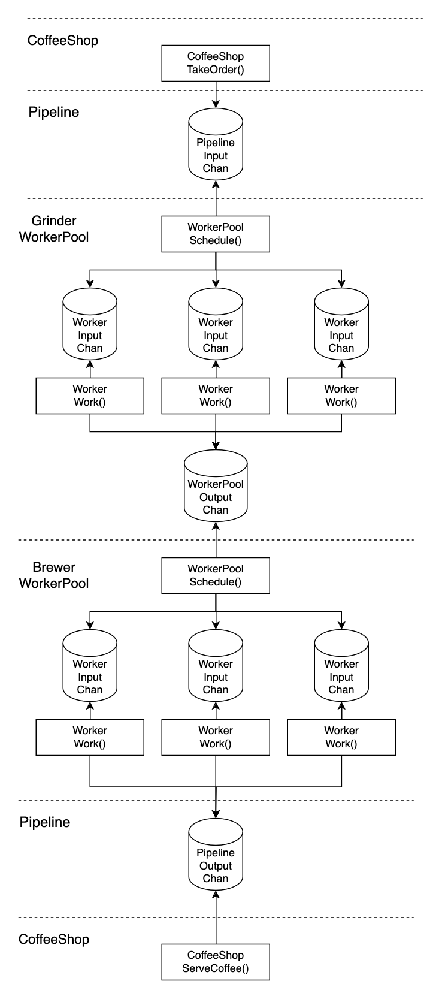
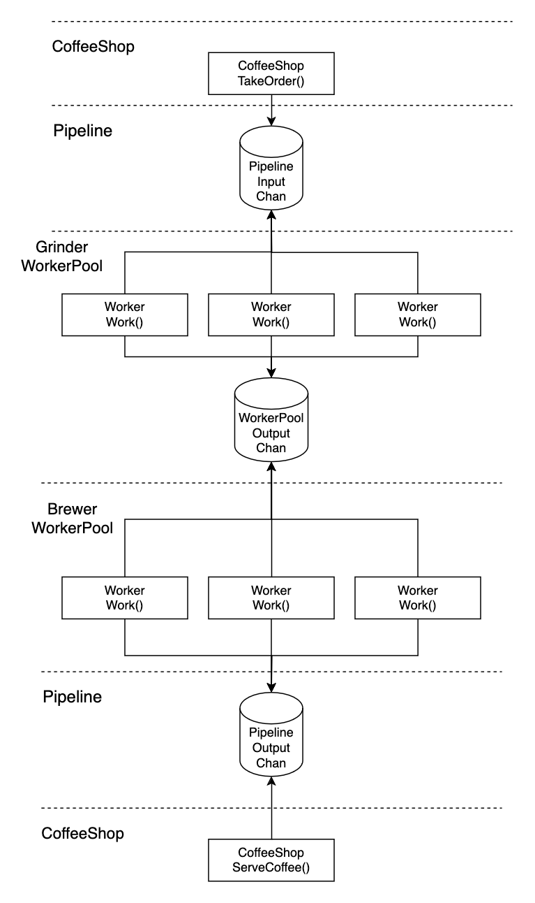

# To Run
To build the code and run:
```bash
$ make run
```

# Solution
## Overview
The solution I went with implements a pipeline with two stages, each stage comprises a pool of workers which concurrently process the beans and convert them into coffee. There are three different scheduling strategies that can be used:
- `SchedulingStrategyPushRoundRobin`: The WorkerPool scheduler pushes to each worker using round-robin.
- `SchedulingStrategyPushFastestAvailableWorker`: The WorkerPool scheduler pushes to the available worker with the highest throughput.
- `SchedulingStrategyPull`: No scheduling is used, each worker pulls from a shared queue

## Push


## Pull


# Results
With the given orders and the given grinders & brewers, the "pull" strategy performs the best, with the "fastest available" scheduler working nearly as fast. Round robin performs the worst.

If the order sizes were different, or the grinder/brewer throughputs were different, then other strategies may work better. For example, the throughput is fairly different between the grinders & brewers. One brewer performs at 4x as well as another. If their throughput was similar then round robin might perform just as well as the other strategies.

# Possible Improvements
- unit tests (!!!)
- handling full channels causing blocking
  - ideally we would take customer orders without blocking. If the pipeline is backed up we might block and lose a customer order (due to customer impatience), so care should be taken to handle this case in a real world application. My solution buffers the channels to a high amount which might not be adequate in a real world application.
- metrics, logging and tracing
  - I only used the Go stdlib for this assignment, but in a real world application it would be good to collect better metrics, differentiate between debug / info logs, and to collect traces to get observability on how the application is performing.
- batching of beans (beans are sent in on an on-order basis and not batched at the different stages)
- different pipelining strategies
  - for ex, we could have different pools with different throughputs, we could send the big jobs to the high-throughput pools and the small jobs to a low-throughput pool.
- my handling of float32 vs int is not elegant; ideally I'd just use one number-type.
- config structs for cleaner code

# Example Output
```bash
$ make run
go run main.go
2024/03/08 17:42:21 coffee-shop-push-round-robin took order Order{ouncesOfCoffeeWanted: 12}
2024/03/08 17:42:21 coffee-shop-push-round-robin took order Order{ouncesOfCoffeeWanted: 12}
2024/03/08 17:42:21 coffee-shop-push-round-robin took order Order{ouncesOfCoffeeWanted: 12}
2024/03/08 17:42:21 coffee-shop-push-round-robin took order Order{ouncesOfCoffeeWanted: 12}
2024/03/08 17:42:21 coffee-shop-push-round-robin took order Order{ouncesOfCoffeeWanted: 12}
2024/03/08 17:42:21 coffee-shop-push-round-robin took order Order{ouncesOfCoffeeWanted: 12}
2024/03/08 17:42:21 coffee-shop-push-round-robin took order Order{ouncesOfCoffeeWanted: 12}
2024/03/08 17:42:21 coffee-shop-push-round-robin took order Order{ouncesOfCoffeeWanted: 12}
2024/03/08 17:42:21 coffee-shop-push-round-robin took order Order{ouncesOfCoffeeWanted: 12}
2024/03/08 17:42:21 coffee-shop-push-round-robin took order Order{ouncesOfCoffeeWanted: 12}
2024/03/08 17:42:21 coffee-shop-push-round-robin:grinder[0] received Beans{units: 24.0g}
2024/03/08 17:42:21 coffee-shop-push-round-robin:grinder[2] received Beans{units: 24.0g}
2024/03/08 17:42:21 coffee-shop-push-round-robin:grinder[1] received Beans{units: 24.0g}
2024/03/08 17:42:23 coffee-shop-push-round-robin:grinder[2] processed Beans{units: 24.0g}
2024/03/08 17:42:23 coffee-shop-push-round-robin:grinder[2] received Beans{units: 24.0g}
2024/03/08 17:42:23 coffee-shop-push-round-robin:brewer[0] received Beans{units: 24.0g}
2024/03/08 17:42:23 coffee-shop-push-round-robin:brewer[0] processed Beans{units: 12.0oz}
2024/03/08 17:42:23 coffee-shop-push-round-robin served order 0
2024/03/08 17:42:25 coffee-shop-push-round-robin:grinder[2] processed Beans{units: 24.0g}
2024/03/08 17:42:25 coffee-shop-push-round-robin:grinder[2] received Beans{units: 24.0g}
2024/03/08 17:42:25 coffee-shop-push-round-robin:brewer[1] received Beans{units: 24.0g}
2024/03/08 17:42:25 coffee-shop-push-round-robin:brewer[1] processed Beans{units: 12.0oz}
2024/03/08 17:42:25 coffee-shop-push-round-robin served order 1
2024/03/08 17:42:26 coffee-shop-push-round-robin:grinder[0] processed Beans{units: 24.0g}
2024/03/08 17:42:26 coffee-shop-push-round-robin:grinder[0] received Beans{units: 24.0g}
2024/03/08 17:42:26 coffee-shop-push-round-robin:brewer[0] received Beans{units: 24.0g}
2024/03/08 17:42:26 coffee-shop-push-round-robin:brewer[0] processed Beans{units: 12.0oz}
2024/03/08 17:42:26 coffee-shop-push-round-robin served order 2
2024/03/08 17:42:27 coffee-shop-push-round-robin:grinder[2] processed Beans{units: 24.0g}
2024/03/08 17:42:27 coffee-shop-push-round-robin:brewer[1] received Beans{units: 24.0g}
2024/03/08 17:42:27 coffee-shop-push-round-robin:brewer[1] processed Beans{units: 12.0oz}
2024/03/08 17:42:27 coffee-shop-push-round-robin served order 3
2024/03/08 17:42:29 coffee-shop-push-round-robin:grinder[1] processed Beans{units: 24.0g}
2024/03/08 17:42:29 coffee-shop-push-round-robin:grinder[1] received Beans{units: 24.0g}
2024/03/08 17:42:29 coffee-shop-push-round-robin:brewer[0] received Beans{units: 24.0g}
2024/03/08 17:42:29 coffee-shop-push-round-robin:brewer[0] processed Beans{units: 12.0oz}
2024/03/08 17:42:29 coffee-shop-push-round-robin served order 4
2024/03/08 17:42:30 coffee-shop-push-round-robin:grinder[0] processed Beans{units: 24.0g}
2024/03/08 17:42:30 coffee-shop-push-round-robin:grinder[0] received Beans{units: 24.0g}
2024/03/08 17:42:30 coffee-shop-push-round-robin:brewer[1] received Beans{units: 24.0g}
2024/03/08 17:42:31 coffee-shop-push-round-robin:brewer[1] processed Beans{units: 12.0oz}
2024/03/08 17:42:31 coffee-shop-push-round-robin served order 5
2024/03/08 17:42:35 coffee-shop-push-round-robin:grinder[0] processed Beans{units: 24.0g}
2024/03/08 17:42:35 coffee-shop-push-round-robin:grinder[0] received Beans{units: 24.0g}
2024/03/08 17:42:35 coffee-shop-push-round-robin:brewer[0] received Beans{units: 24.0g}
2024/03/08 17:42:35 coffee-shop-push-round-robin:brewer[0] processed Beans{units: 12.0oz}
2024/03/08 17:42:35 coffee-shop-push-round-robin served order 6
2024/03/08 17:42:37 coffee-shop-push-round-robin:grinder[1] processed Beans{units: 24.0g}
2024/03/08 17:42:37 coffee-shop-push-round-robin:brewer[1] received Beans{units: 24.0g}
2024/03/08 17:42:37 coffee-shop-push-round-robin:grinder[1] received Beans{units: 24.0g}
2024/03/08 17:42:37 coffee-shop-push-round-robin:brewer[1] processed Beans{units: 12.0oz}
2024/03/08 17:42:37 coffee-shop-push-round-robin served order 7
2024/03/08 17:42:40 coffee-shop-push-round-robin:grinder[0] processed Beans{units: 24.0g}
2024/03/08 17:42:40 coffee-shop-push-round-robin:brewer[0] received Beans{units: 24.0g}
2024/03/08 17:42:40 coffee-shop-push-round-robin:brewer[0] processed Beans{units: 12.0oz}
2024/03/08 17:42:40 coffee-shop-push-round-robin served order 8
2024/03/08 17:42:45 coffee-shop-push-round-robin:grinder[1] processed Beans{units: 24.0g}
2024/03/08 17:42:45 coffee-shop-push-round-robin:brewer[1] received Beans{units: 24.0g}
2024/03/08 17:42:45 coffee-shop-push-round-robin:brewer[1] processed Beans{units: 12.0oz}
2024/03/08 17:42:45 coffee-shop-push-round-robin served order 9
2024/03/08 17:42:45 coffee-shop-push-fastest took order Order{ouncesOfCoffeeWanted: 12}
2024/03/08 17:42:45 coffee-shop-push-fastest took order Order{ouncesOfCoffeeWanted: 12}
2024/03/08 17:42:45 coffee-shop-push-fastest took order Order{ouncesOfCoffeeWanted: 12}
2024/03/08 17:42:45 coffee-shop-push-fastest took order Order{ouncesOfCoffeeWanted: 12}
2024/03/08 17:42:45 coffee-shop-push-fastest took order Order{ouncesOfCoffeeWanted: 12}
2024/03/08 17:42:45 coffee-shop-push-fastest took order Order{ouncesOfCoffeeWanted: 12}
2024/03/08 17:42:45 coffee-shop-push-fastest took order Order{ouncesOfCoffeeWanted: 12}
2024/03/08 17:42:45 coffee-shop-push-fastest took order Order{ouncesOfCoffeeWanted: 12}
2024/03/08 17:42:45 coffee-shop-push-fastest took order Order{ouncesOfCoffeeWanted: 12}
2024/03/08 17:42:45 coffee-shop-push-fastest took order Order{ouncesOfCoffeeWanted: 12}
2024/03/08 17:42:45 coffee-shop-push-fastest:grinder[0] received Beans{units: 24.0g}
2024/03/08 17:42:45 coffee-shop-push-fastest:grinder[2] received Beans{units: 24.0g}
2024/03/08 17:42:45 coffee-shop-push-fastest:grinder[1] received Beans{units: 24.0g}
2024/03/08 17:42:47 coffee-shop-push-fastest:grinder[2] processed Beans{units: 24.0g}
2024/03/08 17:42:47 coffee-shop-push-fastest:brewer[0] received Beans{units: 24.0g}
2024/03/08 17:42:47 coffee-shop-push-fastest:grinder[2] received Beans{units: 24.0g}
2024/03/08 17:42:47 coffee-shop-push-fastest:brewer[0] processed Beans{units: 12.0oz}
2024/03/08 17:42:47 coffee-shop-push-fastest served order 0
2024/03/08 17:42:49 coffee-shop-push-fastest:grinder[2] processed Beans{units: 24.0g}
2024/03/08 17:42:49 coffee-shop-push-fastest:brewer[0] received Beans{units: 24.0g}
2024/03/08 17:42:49 coffee-shop-push-fastest:grinder[2] received Beans{units: 24.0g}
2024/03/08 17:42:49 coffee-shop-push-fastest:brewer[0] processed Beans{units: 12.0oz}
2024/03/08 17:42:49 coffee-shop-push-fastest served order 1
2024/03/08 17:42:50 coffee-shop-push-fastest:grinder[0] processed Beans{units: 24.0g}
2024/03/08 17:42:50 coffee-shop-push-fastest:brewer[0] received Beans{units: 24.0g}
2024/03/08 17:42:50 coffee-shop-push-fastest:grinder[0] received Beans{units: 24.0g}
2024/03/08 17:42:50 coffee-shop-push-fastest:brewer[0] processed Beans{units: 12.0oz}
2024/03/08 17:42:50 coffee-shop-push-fastest served order 2
2024/03/08 17:42:51 coffee-shop-push-fastest:grinder[2] processed Beans{units: 24.0g}
2024/03/08 17:42:51 coffee-shop-push-fastest:brewer[0] received Beans{units: 24.0g}
2024/03/08 17:42:51 coffee-shop-push-fastest:grinder[2] received Beans{units: 24.0g}
2024/03/08 17:42:51 coffee-shop-push-fastest:brewer[0] processed Beans{units: 12.0oz}
2024/03/08 17:42:51 coffee-shop-push-fastest served order 3
2024/03/08 17:42:53 coffee-shop-push-fastest:grinder[1] processed Beans{units: 24.0g}
2024/03/08 17:42:53 coffee-shop-push-fastest:brewer[0] received Beans{units: 24.0g}
2024/03/08 17:42:53 coffee-shop-push-fastest:grinder[1] received Beans{units: 24.0g}
2024/03/08 17:42:53 coffee-shop-push-fastest:grinder[2] processed Beans{units: 24.0g}
2024/03/08 17:42:53 coffee-shop-push-fastest:brewer[1] received Beans{units: 24.0g}
2024/03/08 17:42:53 coffee-shop-push-fastest:grinder[2] received Beans{units: 24.0g}
2024/03/08 17:42:53 coffee-shop-push-fastest:brewer[0] processed Beans{units: 12.0oz}
2024/03/08 17:42:53 coffee-shop-push-fastest served order 4
2024/03/08 17:42:54 coffee-shop-push-fastest:brewer[1] processed Beans{units: 12.0oz}
2024/03/08 17:42:54 coffee-shop-push-fastest served order 5
2024/03/08 17:42:55 coffee-shop-push-fastest:grinder[0] processed Beans{units: 24.0g}
2024/03/08 17:42:55 coffee-shop-push-fastest:brewer[0] received Beans{units: 24.0g}
2024/03/08 17:42:55 coffee-shop-push-fastest:grinder[0] received Beans{units: 24.0g}
2024/03/08 17:42:55 coffee-shop-push-fastest:brewer[0] processed Beans{units: 12.0oz}
2024/03/08 17:42:55 coffee-shop-push-fastest served order 6
2024/03/08 17:42:55 coffee-shop-push-fastest:grinder[2] processed Beans{units: 24.0g}
2024/03/08 17:42:55 coffee-shop-push-fastest:brewer[0] received Beans{units: 24.0g}
2024/03/08 17:42:55 coffee-shop-push-fastest:brewer[0] processed Beans{units: 12.0oz}
2024/03/08 17:42:55 coffee-shop-push-fastest served order 7
2024/03/08 17:43:00 coffee-shop-push-fastest:grinder[0] processed Beans{units: 24.0g}
2024/03/08 17:43:00 coffee-shop-push-fastest:brewer[0] received Beans{units: 24.0g}
2024/03/08 17:43:00 coffee-shop-push-fastest:brewer[0] processed Beans{units: 12.0oz}
2024/03/08 17:43:00 coffee-shop-push-fastest served order 8
2024/03/08 17:43:01 coffee-shop-push-fastest:grinder[1] processed Beans{units: 24.0g}
2024/03/08 17:43:01 coffee-shop-push-fastest:brewer[0] received Beans{units: 24.0g}
2024/03/08 17:43:01 coffee-shop-push-fastest:brewer[0] processed Beans{units: 12.0oz}
2024/03/08 17:43:01 coffee-shop-push-fastest served order 9
2024/03/08 17:43:01 coffee-shop-pull took order Order{ouncesOfCoffeeWanted: 12}
2024/03/08 17:43:01 coffee-shop-pull took order Order{ouncesOfCoffeeWanted: 12}
2024/03/08 17:43:01 coffee-shop-pull took order Order{ouncesOfCoffeeWanted: 12}
2024/03/08 17:43:01 coffee-shop-pull took order Order{ouncesOfCoffeeWanted: 12}
2024/03/08 17:43:01 coffee-shop-pull took order Order{ouncesOfCoffeeWanted: 12}
2024/03/08 17:43:01 coffee-shop-pull took order Order{ouncesOfCoffeeWanted: 12}
2024/03/08 17:43:01 coffee-shop-pull took order Order{ouncesOfCoffeeWanted: 12}
2024/03/08 17:43:01 coffee-shop-pull:grinder[0] received Beans{units: 24.0g}
2024/03/08 17:43:01 coffee-shop-pull took order Order{ouncesOfCoffeeWanted: 12}
2024/03/08 17:43:01 coffee-shop-pull:grinder[2] received Beans{units: 24.0g}
2024/03/08 17:43:01 coffee-shop-pull took order Order{ouncesOfCoffeeWanted: 12}
2024/03/08 17:43:01 coffee-shop-pull took order Order{ouncesOfCoffeeWanted: 12}
2024/03/08 17:43:01 coffee-shop-pull:grinder[1] received Beans{units: 24.0g}
2024/03/08 17:43:03 coffee-shop-pull:grinder[2] processed Beans{units: 24.0g}
2024/03/08 17:43:03 coffee-shop-pull:grinder[2] received Beans{units: 24.0g}
2024/03/08 17:43:03 coffee-shop-pull:brewer[0] received Beans{units: 24.0g}
2024/03/08 17:43:04 coffee-shop-pull:brewer[0] processed Beans{units: 12.0oz}
2024/03/08 17:43:04 coffee-shop-pull served order 0
2024/03/08 17:43:05 coffee-shop-pull:grinder[2] processed Beans{units: 24.0g}
2024/03/08 17:43:05 coffee-shop-pull:grinder[2] received Beans{units: 24.0g}
2024/03/08 17:43:05 coffee-shop-pull:brewer[1] received Beans{units: 24.0g}
2024/03/08 17:43:06 coffee-shop-pull:brewer[1] processed Beans{units: 12.0oz}
2024/03/08 17:43:06 coffee-shop-pull served order 1
2024/03/08 17:43:06 coffee-shop-pull:grinder[0] processed Beans{units: 24.0g}
2024/03/08 17:43:06 coffee-shop-pull:grinder[0] received Beans{units: 24.0g}
2024/03/08 17:43:06 coffee-shop-pull:brewer[0] received Beans{units: 24.0g}
2024/03/08 17:43:06 coffee-shop-pull:brewer[0] processed Beans{units: 12.0oz}
2024/03/08 17:43:06 coffee-shop-pull served order 2
2024/03/08 17:43:07 coffee-shop-pull:grinder[2] processed Beans{units: 24.0g}
2024/03/08 17:43:07 coffee-shop-pull:grinder[2] received Beans{units: 24.0g}
2024/03/08 17:43:07 coffee-shop-pull:brewer[1] received Beans{units: 24.0g}
2024/03/08 17:43:08 coffee-shop-pull:brewer[1] processed Beans{units: 12.0oz}
2024/03/08 17:43:08 coffee-shop-pull served order 3
2024/03/08 17:43:09 coffee-shop-pull:grinder[1] processed Beans{units: 24.0g}
2024/03/08 17:43:09 coffee-shop-pull:grinder[1] received Beans{units: 24.0g}
2024/03/08 17:43:09 coffee-shop-pull:brewer[0] received Beans{units: 24.0g}
2024/03/08 17:43:09 coffee-shop-pull:grinder[2] processed Beans{units: 24.0g}
2024/03/08 17:43:09 coffee-shop-pull:grinder[2] received Beans{units: 24.0g}
2024/03/08 17:43:09 coffee-shop-pull:brewer[1] received Beans{units: 24.0g}
2024/03/08 17:43:10 coffee-shop-pull:brewer[0] processed Beans{units: 12.0oz}
2024/03/08 17:43:10 coffee-shop-pull served order 4
2024/03/08 17:43:10 coffee-shop-pull:brewer[1] processed Beans{units: 12.0oz}
2024/03/08 17:43:10 coffee-shop-pull served order 5
2024/03/08 17:43:11 coffee-shop-pull:grinder[0] processed Beans{units: 24.0g}
2024/03/08 17:43:11 coffee-shop-pull:grinder[0] received Beans{units: 24.0g}
2024/03/08 17:43:11 coffee-shop-pull:brewer[0] received Beans{units: 24.0g}
2024/03/08 17:43:11 coffee-shop-pull:brewer[0] processed Beans{units: 12.0oz}
2024/03/08 17:43:11 coffee-shop-pull served order 6
2024/03/08 17:43:11 coffee-shop-pull:grinder[2] processed Beans{units: 24.0g}
2024/03/08 17:43:11 coffee-shop-pull:brewer[1] received Beans{units: 24.0g}
2024/03/08 17:43:12 coffee-shop-pull:brewer[1] processed Beans{units: 12.0oz}
2024/03/08 17:43:12 coffee-shop-pull served order 7
2024/03/08 17:43:16 coffee-shop-pull:grinder[0] processed Beans{units: 24.0g}
2024/03/08 17:43:16 coffee-shop-pull:brewer[0] received Beans{units: 24.0g}
2024/03/08 17:43:16 coffee-shop-pull:brewer[0] processed Beans{units: 12.0oz}
2024/03/08 17:43:16 coffee-shop-pull served order 8
2024/03/08 17:43:17 coffee-shop-pull:grinder[1] processed Beans{units: 24.0g}
2024/03/08 17:43:17 coffee-shop-pull:brewer[1] received Beans{units: 24.0g}
2024/03/08 17:43:18 coffee-shop-pull:brewer[1] processed Beans{units: 12.0oz}
2024/03/08 17:43:18 coffee-shop-pull served order 9
==================================
coffee-shop-push-round-robin results
==================================
Metrics{
  bestDuration: 2.121789755s
  medianDuration: 10.082625462s
  worstDuration: 24.483609295s
  totalTimeTaken: 24.483947121s
  ordersTaken: 10
  ordersServed: 10
  ozCoffeeServed: 120
}
==================================
coffee-shop-push-fastest results
==================================
Metrics{
  bestDuration: 2.12164454s
  medianDuration: 8.508441671s
  worstDuration: 16.127105889s
  totalTimeTaken: 16.12746924s
  ordersTaken: 10
  ordersServed: 10
  ozCoffeeServed: 120
}
==================================
coffee-shop-pull results
==================================
Metrics{
  bestDuration: 2.122125943s
  medianDuration: 8.484475599s
  worstDuration: 16.484020741s
  totalTimeTaken: 16.484234294s
  ordersTaken: 10
  ordersServed: 10
  ozCoffeeServed: 120
}
```